# Latent Structural Gradient Distillation

This repository contains the implementation of the Latent Structural Gradient Distillation (LSGD) method for training compact student models using knowledge distillation from larger teacher models.

## Project structure

- `main.py`: thin entrypoint that launches the pipeline.
- `configs/parser.py`: argparse parser for training configuration.
- `training/pipeline.py`: `DistillationPipeline` orchestration class.
- `training/training.py`: `DistillationTrainer` class and compatibility wrapper.
- `configs/`: training configuration.
- `data/`: dataset class, metadata split loading, dataloader builders, transforms.
- `model/`: `Teacher` and `Student` models.
- `evaluation/`: metrics and test evaluation.
- `utils/`: artifact saving and zipping helpers.

## Experimental datasets

### Rice seed variety dataset

The rice seed dataset includes six rice varieties widely cultivated in northern Vietnam: BC-15, Huong Thom-1, Nep-87, Q-5, Thien Uu-8, and Xi-23 (<a href="https://doi.org/10.1109/KSE.2015.46" target="_blank">Phan et al., 2015</a>).

For experiments, the data are organized as six binary tasks using a one-versus-rest scheme:
- Positive class: the target variety of each task.
- Negative class: all remaining varieties.

This setup reflects practical seed production scenarios with realistic inter-class variability and potential misclassification cases. Each binary task keeps positive/negative samples balanced. Data are split into train/validation/test with a ratio of **64% / 16% / 20%**.

#### Distribution by rice variety

| Rice variety | Train | Validation | Test | Total |
| --- | ---: | ---: | ---: | ---: |
| BC-15 | 2353 | 588 | 736 | 3677 |
| Huong Thom-1 | 2656 | 664 | 830 | 4150 |
| Nep-87 | 1839 | 460 | 574 | 2873 |
| Q-5 | 1926 | 482 | 602 | 3010 |
| Thien Uu-8 | 1284 | 321 | 401 | 2006 |
| Xi-23 | 2653 | 663 | 829 | 4145 |

#### Sample images

<table>
  <tr>
    <td align="center"><b>BC-15</b></td>
    <td align="center"><b>Huong Thom-1</b></td>
    <td align="center"><b>Nep-87</b></td>
  </tr>
  <tr>
    <td align="center">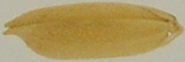</td>
    <td align="center">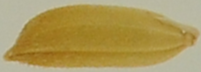</td>
    <td align="center">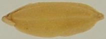</td>
  </tr>
  <tr>
    <td align="center"><b>Q-5</b></td>
    <td align="center"><b>Thien Uu-8</b></td>
    <td align="center"><b>Xi-23</b></td>
  </tr>
  <tr>
    <td align="center">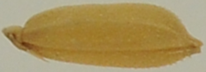</td>
    <td align="center">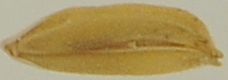</td>
    <td align="center">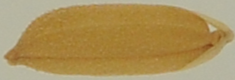</td>
  </tr>
</table>

### Papaya leaf disease dataset

The papaya leaf disease dataset contains **2,500 RGB images** across five classes (500 images per class) (<a href="https://doi.org/10.17632/zjpvzx5nrb.1" target="_blank">Pria et al., 2026</a>):
- Healthy Leaf
- Crushed Papaya Leaves
- Potash Deficiency
- Mold
- Mosaic

Images were captured directly from fields using smartphone cameras under natural conditions. Samples were placed on a white background and photographed under multiple viewpoints and illumination conditions. All images were resized to **224 x 224** and split into **64% / 16% / 20%** for train/validation/test.

#### Sample images

| Healthy Leaf | Crushed Leaves | Potash Deficiency |
| --- | --- | --- |
| 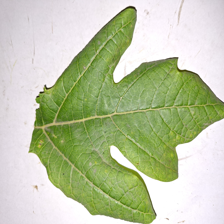 | 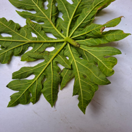 | 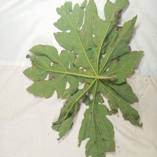 |

| Mold | Mosaic |
| --- | --- |
| 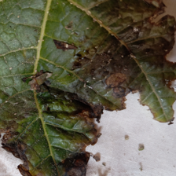 | 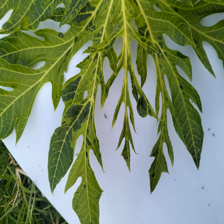 |

### Rice leaf disease dataset

The rice leaf disease dataset contains **5,932 images** in four classes (<a href="https://doi.org/10.17632/fwcj7stb8r.2" target="_blank">Sethy and Kumar, 2024</a>):
- Bacterial Blight: 1,584
- Blast: 1,440
- Brown Spot: 1,600
- Tungro: 1,308

Images were collected from agricultural fields in western Odisha using a Nikon DSLR-D5600 camera (18-55 mm lens). Disease regions were manually cropped to form samples. The Tungro subset has variable resolution (approximately 209 to 603 pixels for both width and height), while other images were standardized at 300 x 300. Data are split into **64% / 16% / 20%** for train/validation/test.

#### Sample images

<table>
  <tr>
    <td align="center"><b>Bacterial Blight</b></td>
    <td align="center"><b>Blast</b></td>
    <td align="center"><b>Brown Spot</b></td>
    <td align="center"><b>Tungro</b></td>
  </tr>
  <tr>
    <td align="center">
      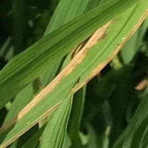
    </td>
    <td align="center">
      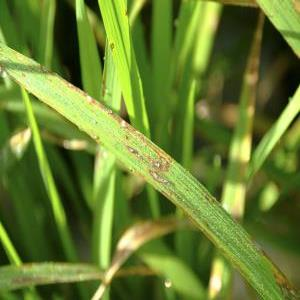
    </td>
    <td align="center">
      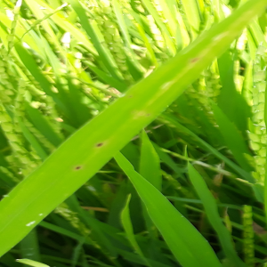
    </td>
    <td align="center">
      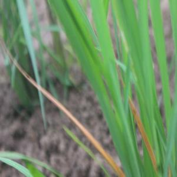
    </td>
  </tr>
</table>
